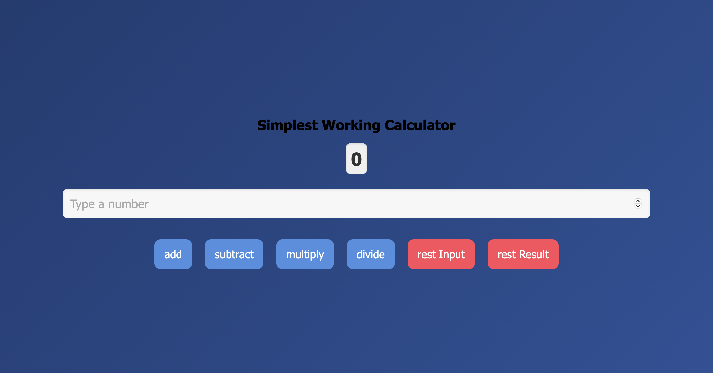

# 🧮 Simplest Working Calculator

A modern, responsive calculator built with **React**. This app supports basic arithmetic operations like addition, subtraction, multiplication, and division. It features a clean UI and smooth user experience using functional components and React hooks.

---

## 🚀 Features

- 🔢 Basic operations: add, subtract, multiply, divide
- 🧹 Reset input and result independently
- 🎨 Responsive, modern UI with styled buttons and layout
- ⚛️ Built with React and React Hooks (`useState`, `useRef`)

---

## 📸 Preview

  
> 

---

## 🛠️ Tech Stack

- **Frontend:** React (Vite or Create React App)
- **Language:** JavaScript (ES6+)
- **Styling:** Custom CSS

---

## 📂 Folder Structure
REACTLAB/
├── public/
├── src/
│ ├── App.js
│ ├── App.css
│ └── index.js
├── .gitignore
├── package.json
└── README.md
## 🧑‍💻 Getting Started

Follow these instructions to get a local copy up and running:

### 1. Clone the repository

```bash
git clone https://github.com/KingBenzo123/calculator-app.git
cd calculator-app

### 2.
npm install
### 3.
npm start
Open your browser and go to http://localhost:3000


✅ Usage Instructions

Enter a number into the input field
Click one of the operation buttons: add, subtract, multiply, divide
Use Reset Input to clear the field
Use Reset Result to reset the result back to 0

Built with ❤️ by Abenezer Bekele
